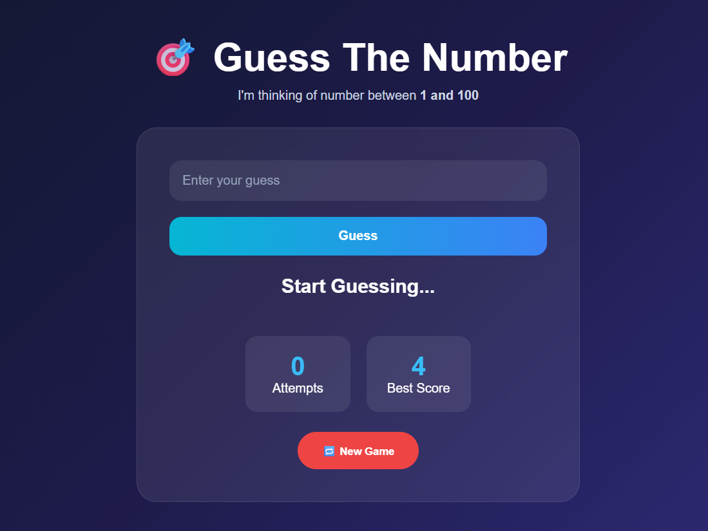

# 🎯 Number Guessing Game

A simple and responsive **Number Guessing Game Web Application** built using **HTML, CSS, and JavaScript**. The game generates a random number between 1 and 100 and provides helpful hints based on how close the guess is to the target number.

## 🚀 Live Demo

🔗 **[Number Guessing Game](#)**

> Replace `#` with your live Vercel or GitHub Pages URL.

---

## 📌 Project Overview

The Number Guessing Game is a browser-based game where the player needs to guess a randomly generated number between **1 and 100**.

The objective is to find the correct number using the **fewest possible attempts**.

JavaScript handles random number generation, user input, hint logic, attempts tracking, best score management, and game restart functionality.

---

## ✨ Features

* 🎯 Random number generation between 1 and 100
* 🔢 User input validation
* 💡 Dynamic hint system based on guess distance
* 📈 High / Low and Very High / Very Low hints
* 🚀 Too High / Too Low hints for distant guesses
* 🎉 Correct answer notification
* 📊 Real-time attempts tracking
* 🏆 Best score tracking
* 💾 Best score stored using `localStorage`
* 🔄 New Game / Restart functionality
* 🎨 Dynamic hint colors
* 📱 Responsive design


---

## 🛠️ Technologies Used

* **HTML5** – Structure of the game
* **CSS3** – Styling, layout, animations, and responsive design
* **JavaScript** – Game logic, hint system, scoring, and controls
* **LocalStorage** – Stores the best score
* **CSS Media Queries** – Responsive design

---

## 📂 Project Structure

```text
Number-Guessing-Game/

│
├── index.html
├── style.css
├── script.js
└── README.md
```

---

## ⚙️ How It Works

A random number between **1 and 100** is generated when the game starts.


Each valid guess increases the attempts counter. The game compares the guess with the target number and provides a hint based on the difference.

---

## 💡 Hint System

| Difference | Guess Higher | Guess Lower |
| ---------- | ------------ | ----------- |
| `0`        | 🎉 Correct   | 🎉 Correct  |
| `1 - 5`    | 🔥 High      | 🔥 Low      |
| `6 - 15`   | 📈 Very High | 📉 Very Low |
| `16+`      | 🚀 Too High  | ❄️ Too Low  |

The hints help the player adjust their next guess and find the number in fewer attempts.

---

## 📊 Score

The **Attempts** counter increases with every valid guess.

The goal is to find the correct number using the **minimum number of attempts**.

---

## 🏆 Best Score

The lowest number of attempts is saved as the **Best Score** using browser `localStorage`.


The saved score remains available even after refreshing the browser.

---

## 🎮 Game Controls

### Desktop

Enter a number between **1 and 100** and click the **Guess** button.

```text
Enter Number → Click Guess
```

### New Game

Click **🔁 New Game** to generate a new number and reset the current game.

The saved best score is retained.

---

## 💻 How to Run Locally

1. Clone the repository:

```bash
git clone https://github.com/NileshPadalwar/Number_Guessing_Game.git
```

2. Navigate to the project:

```bash
cd Number-Guessing-Game
```

3. Open `index.html` in your browser.

Or use **Live Server** in VS Code.

---

## 📸 Preview




---

## 🎯 Learning Outcomes

This project demonstrates:

* Generating random numbers using JavaScript
* Handling user input and validation
* Implementing conditional logic
* Building a dynamic hint system
* Updating the DOM dynamically
* Tracking attempts and scores
* Using `localStorage`
* Handling button events
* Resetting game state
* Creating responsive layouts

---

## 👨‍💻 Author

**Nilesh Padalwar**

Frontend Developer | Angular Developer | Web Developer

---

## 📄 License

This project is created for learning and practice purposes.
